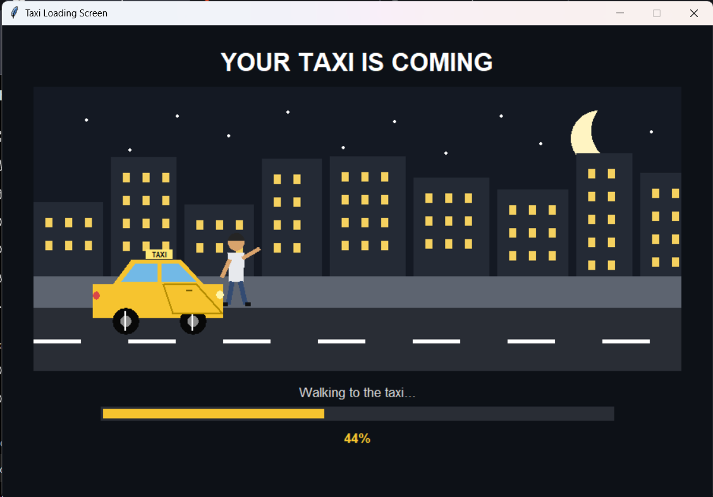

# 🚕 Taxi Loading Screen

An animated taxi-themed loading screen built with Python.

The application displays a complete pickup animation: a passenger waits for a taxi, signals the driver, enters the vehicle, and the taxi continues its journey while the loading progress advances.

## ✨ Features

- Animated taxi pickup sequence
- Character and taxi animations
- Dynamic loading progress bar
- Multiple animation stages
- Smooth transitions between scenes
- Custom graphical interface

## 🛠️ Technologies

- Python
- Tkinter
- Python animation logic
- Git & GitHub

## ▶️ How to Run

1. Download or clone this repository.
2. Make sure Python is installed.
3. Open the project folder.
4. Run:

```bash
python taxi_loading.py
```

## 🎯 Project Purpose

This project was created as part of my Python learning journey and focuses on applying programming concepts in a visual application.

It helped me practice:

- Functions
- Conditions
- Loops
- Variables
- GUI development
- Animation logic
- Program flow
- Git version control

## 📷 Preview



## 🚀 Future Improvements

- Improve character animations
- Add additional visual effects
- Improve animation transitions
- Add sound effects
- Package the application as a Windows executable

## 📌 Status

**Version 1.0 — Functional prototype**